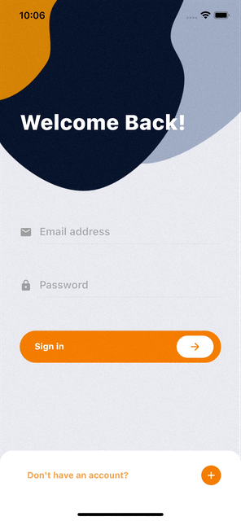
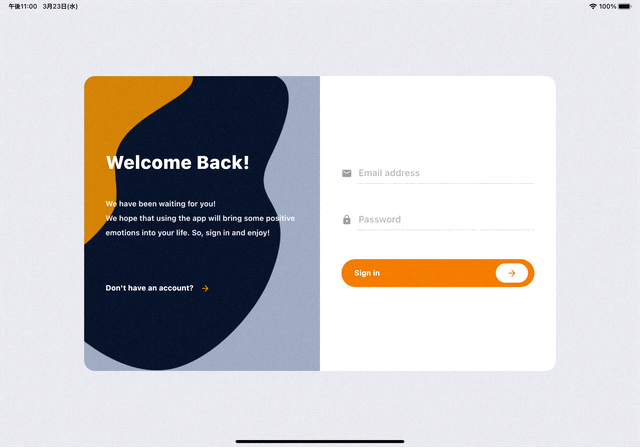
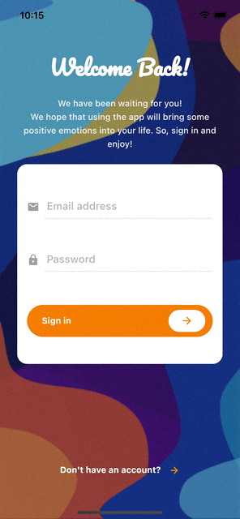
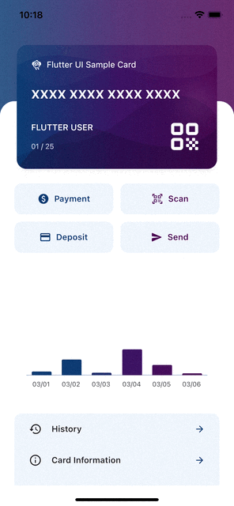
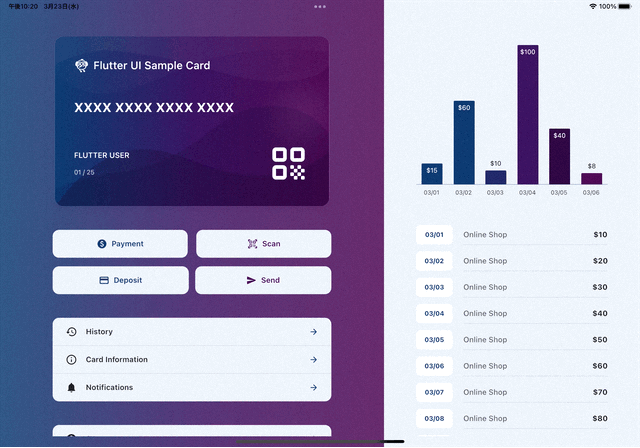

# Flutter UI Sample

Sample designs for application sign-in, credit card application, and fan site detail pages.  
I hope you will find this information useful for designing in Flutter.  

I will be modifying the source code and adding designs as needed.  
If you have a design that you would like to use as a reference, we will be ready to accept it via Twitter in the future.  

<br />

## Simple Sign in Page
|Standard|Wide|
|---|---|
|||


## Paging Sign in Page
|Standard|Wide|
|---|---|
|||


## Card Payment Page
|Standard|Wide|
|---|---|
|||

## Fan Site Page
|Standard|Wide|
|---|---|
|||


<br />

## Running example
```shell
# Git Clone
$ git clone https://github.com/mytooyo/flutter_ui_sample.git
$ cd flutter_ui_sample

# FLutter runninng
$ flutter run
```


## License
The source code is licensed MIT.
